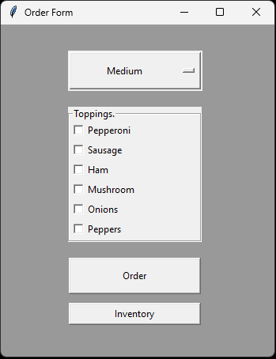
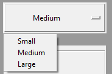
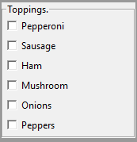
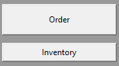
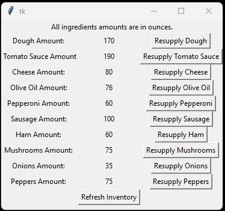
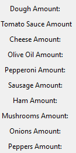
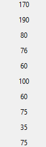
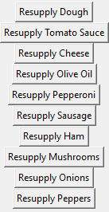
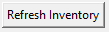

# Info About Program
To be put in later

# ToRun

Run main.py file

# info about the program
This is the order form window, and it consists of three sections

At the top we have the pizza size, there are 3 options, Small, Medium, and Large

There is a topping section, just select the ones that you want

Then there is the Order and Inventory, the order button places the order, and subtracts the correct ingredients from the library, and the Inventory opens the inventory window.

This is the Inventory window

On the left there is a list of ingredients

In the middle is how much of each ingredient is left, displayed in ounces

And on the right there are buttons to take and resupply the inventory for when resupply comes in

And then there is a button to refresh the window, to show the most recent numbers

